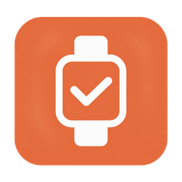
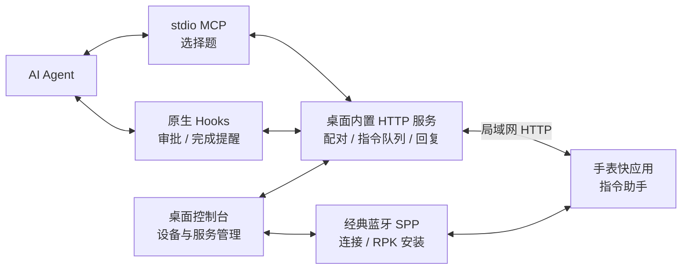

<p align="center">
  
</p>

<h1 align="center">小米手表 AI 指令助手</h1>

<p align="center">AI 提问、操作审批、完成提醒，手表直接回复。</p>

<p align="center">
  <a href="./LICENSE"></a>
  
  
  
</p>

<p align="center">
  <a href="#功能特性">功能特性</a> ·
  <a href="#快速上手">快速上手</a> ·
  <a href="#开发与构建">开发与构建</a> ·
  <a href="#文档索引">文档索引</a>
</p>

**小米手表 AI 指令助手**（`mi-watch-agent-command-pilot`）连接 AI 编程工具与小米穿戴设备。桌面应用负责设备连接、快应用安装和 Agent 接入，手表端负责显示指令并回传回复，让你在离开电脑时也能回应选择题、处理审批或查看任务完成提醒。

桌面端采用 **Tauri 2、Rust、React 和 TypeScript**，内嵌 AstroBox 公共组件、局域网 HTTP 服务及手表安装包。使用桌面应用无需额外运行 Python 服务或安装 AstroBox 客户端。

> 当前已验证机型为 **Redmi Watch 5**。其他小米手表与手环的安装、界面和通信能力需要分别验证，详见 [设备兼容范围](./docs/DEVICE_COMPATIBILITY.md)。

## 功能特性

| 功能 | 说明 |
| --- | --- |
| 💬 手表选择题 | 通过 MCP 工具 `ask_watch_question` 发送 2–6 个选项，支持单选、多选及返回电脑输入。 |
| ✅ 操作审批 | 通过 Agent 原生审批钩子接收权限请求，在手表上拒绝、允许一次，或在支持时保存信任规则。 |
| 🔔 完成提醒 | 将 Agent 本轮任务的完成消息发送至手表。可选 ntfy 通知，用于通过手机转发提醒。 |
| ⌚ 设备管理 | 登录小米账号、同步设备、蓝牙连接，并安装、升级或重新安装内置的「指令助手」快应用。 |
| 🔗 Agent 接入 | 在桌面端接入、停用或修复 MCP 与钩子配置，修改前备份原配置并保留其他处理器。 |
| 🖥️ 指令控制台 | 管理服务与端口、生成配对码、测试真实连接，并按状态查看指令及回复。 |
| 📦 在线更新 | 发布构建配置更新源后，可检查桌面新版本、校验更新包签名并安装。手表快应用单独升级。 |

### Agent 支持范围

| Agent | MCP 选择题 | 审批与完成通知钩子 |
| --- | --- | --- |
| Codex | 支持 | 支持 |
| Claude Code | 支持 | 支持 |
| Cursor | 支持 | 支持 |
| Claude Desktop | 支持 | — |
| Antigravity | 支持 | — |
| Windsurf | 支持 | — |

选择题使用 MCP；工具权限审批使用 Agent 的原生审批钩子。接入后需要重新打开 Agent 会话，实际可用性取决于目标 Agent 是否已加载对应配置。

## 平台与设备

桌面发布工作流覆盖 **macOS Apple Silicon、macOS Intel 和 Windows x64**。Windows 配置、构建步骤及当前验证范围见 [Windows 配置与构建](./docs/WINDOWS.md)。

穿戴设备需要满足以下条件：

- 属于当前登录的小米账号，且可获取连接凭据。
- 支持当前桌面传输使用的经典蓝牙 SPP，以及第三方 Vela 快应用安装。
- 支持快应用的 `system.fetch` 接口，并能通过局域网访问电脑 HTTP 服务。

**蓝牙用于连接与安装，局域网用于指令收发。** 安装成功后还需完成配对与连接测试；仅支持 BLE 的设备无法保证通过当前安装路径工作。手表界面以 432 设计宽度开发，其他屏幕尺寸与形状仍需实测。

## 快速上手

### 1. 启动桌面应用

安装并打开「小米手表 AI 指令助手」。从源码启动的步骤见 [开发与构建](#开发与构建)。

进入 **指令** 页面，确认服务显示「运行中」。默认端口为 `8000`，电脑与手表需要处于能够互相访问的局域网。

### 2. 连接设备并安装快应用

1. 在桌面端登录小米账号，同步账号下的穿戴设备。
2. 选择设备，查看型号与兼容说明，点击 **连接所选设备**。
3. 连接成功后，应用自动检查「指令助手」的安装状态与版本编号。
4. 根据提示点击 **安装到设备** 或 **升级到新版本**，完成后在手表上打开「指令助手」。

升级或重新安装时，桌面端会先卸载旧包并确认移除，再传输新包，最后核对包名与版本编号。详细流程见 [手表应用安装与升级](./docs/WATCH_APP_INSTALLATION.md)。

### 3. 配对并测试连接

1. 在桌面端 **指令** 页面点击 **生成配对码**。
2. 在手表端输入桌面显示的电脑地址与 6 位配对码。
3. 配对完成后，点击桌面端 **测试手表连接**。
4. 在手表端于 60 秒内点击 **确认连接**，桌面显示「连接正常」即完成验证。

配对码有效期为 **5 分钟**，成功使用一次后失效。「配对已保存」表示电脑保留了凭据；「手表已连接」表示近期收到真实手表的认证请求。

### 4. 接入 Agent

1. 打开 **Agent → MCP 选择题**，在目标 Agent 上点击 **接入**；旧入口或失效路径点击 **修复**。
2. 如需操作审批和完成提醒，在 **审批与完成通知** 标签中启用对应 Agent 的钩子。
3. 重新打开 Agent 会话，确认已加载 `ask_watch_question` 工具。

MCP 工具调用参数示例：

```json
{
  "title": "实现方式",
  "question": "这次采用哪种实现方式？",
  "options": ["复用现有组件", "新增独立组件"],
  "is_multiselect": false,
  "timeout_seconds": 90
}
```

正常回复返回 `status: "answered"` 和 `selected_options`。选择「在电脑输入」返回 `computer_input`；超时或服务异常分别返回 `timeout` 或 `error`，应回到 Agent 的电脑端交互。自由文本问题直接在电脑端处理。

## 工作原理



同一个桌面可执行文件提供三类入口：

| 入口 | 用途 |
| --- | --- |
| `agent-command-pilot` | 启动桌面控制台与后台服务。 |
| `agent-command-pilot --mcp` | 作为 stdio MCP 服务，向已运行的桌面服务发送选择题。 |
| `agent-command-pilot --hook permission` | 处理原生权限审批请求。 |
| `agent-command-pilot --hook stop` | 发送本轮任务完成提醒。 |

Windows 可执行文件名为 `agent-command-pilot.exe`。日常使用由桌面端自动生成接入配置，无需手动填写入口路径；MCP 与钩子运行期间需要保持桌面服务开启。

## 开发与构建

以下路径均相对于 `mi-watch-agent-command-pilot` 目录。

### 环境准备

- Node.js 22 与 pnpm 11.23.0（与当前 CI 一致）。
- Rust stable 工具链。
- macOS：Xcode Command Line Tools。
- Windows：MSVC 工具链、Microsoft C++ Build Tools 和 WebView2，详见 [Windows 配置与构建](./docs/WINDOWS.md)。

### 启动桌面端

```bash
cd apps/desktop
pnpm install --frozen-lockfile
pnpm tauri dev
```

### 检查与打包

在 `apps/desktop` 目录执行：

```bash
# 前端测试与构建
node --test tests/*.test.mjs
pnpm run build

# Rust 库测试
cargo test --manifest-path src-tauri/Cargo.toml -p agent-command-pilot --lib --locked

# 桌面应用打包
pnpm tauri build
```

桌面构建产物位于 `apps/desktop/src-tauri/target/release/bundle/`。Windows PowerShell 的测试文件枚举与 NSIS 打包命令见 [Windows 配置与构建](./docs/WINDOWS.md)。

### 构建手表端

从项目根目录执行：

```bash
cd watch
npm ci
npm run build
```

`npm run build` 生成调试包，可使用工具链内置的开发证书，产物位于 `watch/dist/`。Release 包使用 `npm run release`，需要你自己的本地签名证书。若尚无证书，可在 `watch` 目录生成开发用证书：

```bash
mkdir -p sign
openssl req -x509 -newkey rsa:2048 -nodes -keyout sign/private.pem -out sign/certificate.pem -days 3650 -subj "/CN=watch-app-development"
npm run release
```

私钥和证书放在 `watch/sign/`，不提交到仓库；正式发布应由维护者保存并复用对应签名材料。

构建时自动检测电脑局域网地址，也可设置 `WATCH_SERVER_URL` 指定默认服务地址。构建会生成 `watch/src/common/config.js`；该本机配置不提交到仓库。显式指定 `WATCH_SERVER_URL` 时，不会把本机 Bonjour 名称写入安装包。

仓库内置安装包使用示例地址 `http://192.168.1.100:8000`，首次配对时请在手表上输入桌面应用显示的实际电脑地址。构建公开安装包可使用 `WATCH_SERVER_URL=http://192.168.1.100:8000 npm run release`。

手表构建**不会自动替换桌面内置安装包**。更新内置包时，需要同步：

- `apps/desktop/src-tauri/resources/watch-app.rpk`：手表安装包。
- `apps/desktop/src-tauri/resources/watch-app.json`：版本信息与 SHA-256。
- `apps/desktop/src-tauri/src/lib.rs`：`EXPECTED_SHA256` 校验值。

桌面与手表版本独立管理。桌面签名更新包及发布流程见 [在线更新与发布](./docs/UPDATES.md)；普通开发构建无需更新签名密钥。

### 项目结构

```text
mi-watch-agent-command-pilot/
├── apps/desktop/
│   ├── public/                # 桌面图标等静态资源
│   ├── src/                   # React / TypeScript 界面
│   ├── src-tauri/             # Rust 后端、MCP、Hooks 与内置 RPK
│   └── tests/                 # 前端与发布流程测试
├── watch/                     # Vela 手表快应用源码与打包脚本
├── scripts/                   # 桌面发布与原生入口检查
├── docs/                      # 使用、兼容、发布文档与第三方许可
├── .github/workflows/         # Windows 构建与多平台发布
├── LICENSE                    # 项目许可证
└── NOTICE                     # 第三方组件与版权声明
```

## 配置与数据

- **服务配置**：默认端口 `8000`，可在「指令」页修改为 `1–65535`。MCP 与钩子读取保存后的端口，手表端需要同步修改电脑地址。
- **会话记录**：指令与回复保存在当前应用会话的内存中；停止、重启或切换端口会使未完成指令过期，退出应用后不保留历史。
- **本机凭据**：设置、设备连接凭据和配对令牌哈希保存在当前用户的 `.agent-command-pilot/` 目录。设备连接凭据当前采用本地明文文件存储，Unix 上限制为用户自身访问，未使用系统 Keychain。
- **网络通信**：设备同步需要访问小米账号服务；指令与回复通过局域网 HTTP 传输。启用 ntfy 后会向所配置的通知服务发送提醒，默认关闭且不包含指令标题与正文。
- **Agent 配置**：修改前保存 `<文件名>.redmi-watch.bak` 备份；应用移动或安装路径变化后，可在「Agent」页修复入口。

## 常见问题

| 现象 | 处理方式 |
| --- | --- |
| 服务启动失败或端口被占用 | 关闭占用端口的独立开发服务，或在桌面端修改端口；同时更新手表端电脑地址。 |
| 已配对但显示离线 | 确认桌面服务运行、手表快应用已打开、双方网络可达，再执行「测试手表连接」。 |
| 显示「配对异常」 | 检查手表端电脑地址，必要时生成新的配对码并重新配对。 |
| Agent 看不到 MCP 工具或钩子未生效 | 检查接入状态与配置详情，点击「修复」后重新打开 Agent 会话。 |
| 快应用安装成功但无法收发指令 | 检查设备的 `system.fetch` 能力和网络连接，参阅设备兼容文档。 |
| 开发构建提示未开通在线更新 | 当前源码默认未设置更新地址，需按发布文档配置并发布签名更新包。 |


## 文档索引

- [设备兼容范围](./docs/DEVICE_COMPATIBILITY.md)
- [手表应用安装与升级](./docs/WATCH_APP_INSTALLATION.md)
- [Windows 配置与构建](./docs/WINDOWS.md)
- [在线更新与发布](./docs/UPDATES.md)
- [版本更新说明](./docs/RELEASE_NOTES.md)

## 贡献

提交前请阅读 [贡献指南](./CONTRIBUTING.md)。问题反馈、功能建议和使用问题请通过 [Issue 表单](https://github.com/YoungWWan/mi-watch-agent-command-pilot/issues/new/choose) 提交；PR 请填写仓库提供的模板。

欢迎提交问题与改进建议。反馈时请提供桌面系统、应用版本、设备型号与固件版本、复现步骤及相关日志；日志中的账号信息、凭据与令牌请先移除。

提交代码前运行与改动相关的检查。涉及手表界面、安装或蓝牙通信的变更，请注明真机验证的设备与结果；新增机型请说明安装、界面显示和指令收发各自的验证情况。

## 许可证与致谢

项目采用 **GNU AGPL-3.0** 许可证，完整文本见 [LICENSE](./LICENSE)，第三方组件与版权声明见 [NOTICE](./NOTICE)。

感谢 **AstralSight Studios** 提供的 AstroBox 公共模块与小米协议实现，以及 Tauri、React、Rust 和 Xiaomi Vela 生态的开源工具。
